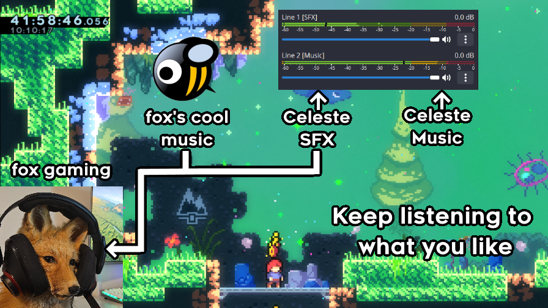

<div align="center">
	
</div>

**AudioSplitter** is a Celeste modification that allows users to playback game's music and SFX on different audio output devices.

The main use case is recording music and SFX on different audio channels in combination with [Virtual Audio Cables](https://vac.muzychenko.net/en/).
This also lets users to record music while listening to other stuff.

<div align="center">
	
</div>

The mod is distributed on [GameBanana](https://gamebanana.com/mods/556416) and can be installed using [Olympus](https://everestapi.github.io/#olympus).

# Installation
1. Open console and `cd` to Celeste's Mod folder
2. Clone the repository
```bash
git clone https://github.com/ACherryJam/AudioSplitter.git
```
3. Open `AudioSplitter.sln` in Visual Studio

# Mod structure
TODO: Write how the mod works. Class diagram would be cool.